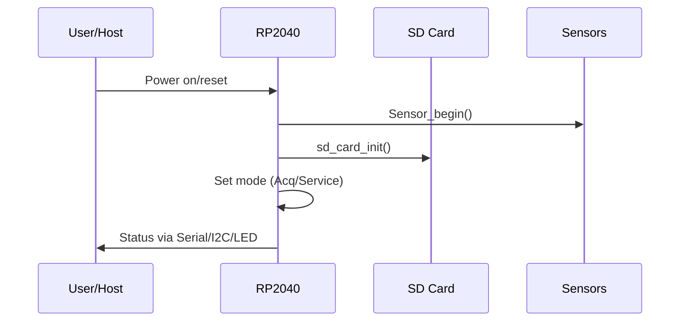
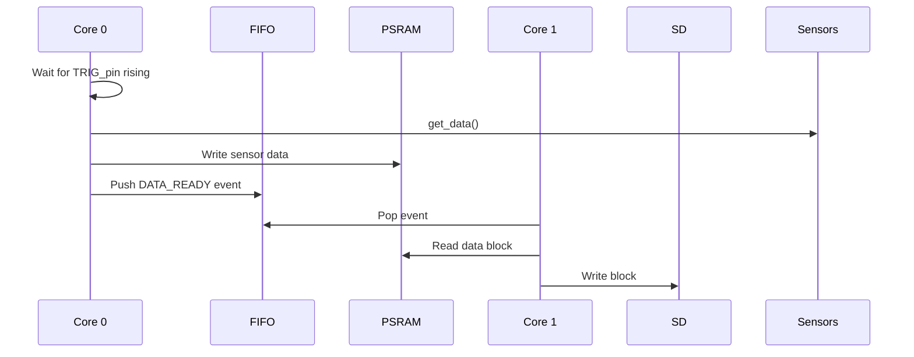

# 🏗️ Firmware Architecture

The Five Channel Hub firmware is designed for robust, high-throughput, multi-sensor logging on the RP2040. It leverages dual-core concurrency, advanced buffering, and modular hardware abstraction to ensure reliability and extensibility.

---

## 1. System Overview

```mermaid
flowchart TD
    subgraph Core 0 [Core 0: Acquisition]
        A0[setup()]
        A1[Sensor Init]
        A2[Main Loop]
        A3[Mode Check]
        A4[Acquisition Mode]
        A5[Trigger Wait & Data Acquisition]
        A6[Buffer Data → PSRAM]
        A7[Service Mode/Config/Diag]
    end
    subgraph Core 1 [Core 1: Logging]
        B0[SD Init]
        B1[File Management]
        B2[Logging Loop]
        B3[Read from PSRAM]
        B4[Write to SD Card]
        B5[Diagnostics]
    end
    FIFO[Inter-core FIFO]
    Watchdog[Watchdog Timer]
    LED[NeoPixel Status]
    User[User Commands (I2C/Serial/EEPROM)]

    A6 -- Data Ready --> FIFO
    FIFO -- Event --> B2
    B4 -- File Close Ack --> FIFO
    A2 -- Health Flag --> Watchdog
    B2 -- Health Flag --> Watchdog
    A2 -- Status --> LED
    User -- Config/Diag --> A7
```

---

## 2. Main Classes & Data Flow

### `Sensors`  
- **Purpose:** Abstracts all sensor hardware; handles init, power, and readout.
- **Key Methods:**
    - `Sensor_begin(init, power_on)`
    - `liveReadEGP()` / `livereadMFL()`
    - `checkSensors()`

### `Acquire`
- **Purpose:** Manages data acquisition cycle, triggering, and buffering.
- **Key Methods:**
    - `begin()`
    - `get_data()` – Called on trigger; samples sensors, packs data, writes to PSRAM.
    - `ExecuteWireCmd(cmd, data)` — Handles config/diagnostics from master.

### `Logging`
- **Purpose:** Handles all SD card operations, log file management, and PSRAM reads.
- **Key Methods:**
    - `sd_card_init()`
    - `getFilename()`
    - `create_file()`
    - `check_fifo(fifo_val)`
    - `psram_read_data()` – Reads data blocks from PSRAM for logging.

### PSRAM Buffer
- **Role:**  
  Temporary high-speed buffer for raw sensor data (8MB), decoupling acquisition from SD write latency.

### SD Card Logging
- **Role:**  
  Preallocated log files (default 128MB) written in large blocks for efficiency. File naming follows `HIDxxSIDxx_yyyy.hex`.

---

## 3. Key Firmware Flows

### Startup & Setup



### Acquisition Cycle



---

## 4. Configuration & Command Handling

- **I2C/Serial:** Two-way config/diagnostic via master host or external controller.
- **EEPROM:** Stores persistent parameters (IDs, calibration, defaults).
- **Diagnostics:** On-demand tests (SD, PSRAM, sensors), status reporting, and error signaling.

### Command Handler Pseudocode

```cpp
void ExecuteWireCmd(uint8_t cmd, uint8_t data) {
  switch(cmd) {
    case I2C_CMD_SD_CON: /* Connect SD */ break;
    case I2C_CMD_SD_DISCON: /* Disconnect SD */ break;
    case SID_REG: /* Set/Read SID */ break;
    case HID_REG: /* Set/Read HID */ break;
    // ... Other config/diag commands ...
  }
}
```

---

## 5. Core Definitions & Macros

See `include/function.h` for all hardware macros, constants, and configuration options. Key parameters:

- `BAUDRATE`, `COM_BAUDRATE` – Serial speeds
- `LOG_BUFF_SIZE` – Buffer size for SD writes
- `FILE_SIZE_LIMIT` – Maximum log file size
- `SAMPLE_BUFFER_SIZE` – Per-sample data size (EGP/MFL)
- `WDT_RESET_TIME` – Watchdog period

---

## 6. Reliability & Error Handling

- **Watchdog**: Both cores must periodically signal “health” or device resets.
- **LED Codes**:  
    - Blue: Idle/ready  
    - Green: Logging  
    - Red: Error (e.g., SD card or sensor failure)
- **Error Codes**: Propagated via serial, I2C, and log file markers.

---

## 7. Extending the Architecture

- **New Sensors:** Add to `Sensors` and update acquisition logic.
- **New Commands:** Extend command handler in `Acquire`.
- **Additional Logging:** Extend `Logging` class (e.g., new formats, cloud upload).
- **Testing:** Integrate with existing test functions (`test_sd_card()`, `test_psram()`).

---

## 8. File Structure Reference

| Path             | Purpose                        |
|------------------|-------------------------------|
| `src/main.cpp`   | Startup, main loop, triggers  |
| `src/function.cpp`| SD, logging, diagnostics      |
| `src/psram_spi.c`| PSRAM low-level interface      |
| `include/function.h`| Pins, config, command defs  |
| `include/psram_spi.h`| PSRAM API, macros          |

---

## 9. Example: Adding a New Command

1. Define new macro in `function.h`:
   ```cpp
   #define I2C_CMD_NEW_FEATURE 0x08
   ```
2. Add handling in `ExecuteWireCmd`:
   ```cpp
   case I2C_CMD_NEW_FEATURE: /* do stuff */ break;
   ```
3. Update documentation in [API-Reference.md](API-Reference.md).

---

**For detailed class/method documentation and code walkthroughs, see [Developer-Guide.md](Developer-Guide.md).**