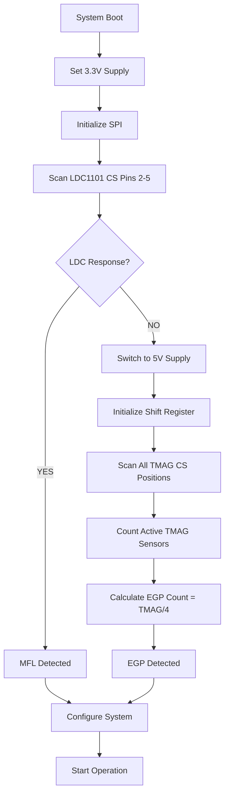

# Sensor Auto Detect Implementation

## Overview
This document outlines the implementation of automatic sensor detection for the HUB-Code system. The auto-detect mechanism eliminates the need for manual sensor configuration by intelligently probing the hardware and determining sensor types and quantities automatically.

## Current System Architecture

### Power Supply Management
- **Master Control**: `SENSOR_SUPPLY_SEL0` and `SENSOR_SUPPLY_SEL1` pins control voltage
- **Slot Control**: `SENSOR_PS_EN_pin` (always HIGH - local enable)
- **Voltage Options**:
  - 3.3V: `SEL0=LOW, SEL1=LOW` 
  - 5V: `SEL0=LOW, SEL1=HIGH`
  - OFF: `SEL0=HIGH, SEL1=HIGH` (Hi-Z)

### Current Sensor Types
- **MFL (Magnetic Flux Leakage)**: 4 LDC1101 + 8 TMAG5170, operates at 3.3V
- **EGP (Eddy Gap Probe)**: Up to 32 TMAG5170 (8 boards × 4 sensors), operates at 5V

## Auto Detection Algorithm

### Phase 1: Initial Power-On Detection
```
1. System Startup
   ├── Power all slots at 3.3V (safe voltage for both sensor types)
   ├── Initialize SPI communication
   └── Begin sensor detection sequence
```

### Phase 2: LDC1101 Detection (MFL Check)
```
2. MFL Sensor Detection
   ├── Attempt LDC1101 communication on known CS pins (2-5)
   ├── Send WHO_AM_I or device ID commands
   ├── If LDC1101 responds:
   │   ├── → DETECTED: MFL sensor configuration
   │   ├── → Count LDC sensors (typically 4)
   │   ├── → Count associated TMAG sensors (typically 8)
   │   └── → Set sensor_type = SENSOR_TYPE_MFL
   └── If NO LDC1101 response:
       └── → Continue to EGP detection
```

### Phase 3: Shift Register Gap Detection (EGP Check)
```
3. EGP Sensor Detection
   ├── Switch power supply to 5V (optimal for EGP)
   ├── Initialize Shift Register system
   ├── Perform CS line scanning:
   │   ├── Shift through all possible CS positions
   │   ├── Count "gaps" where no TMAG5170 responds
   │   └── Calculate EGP board count from active sensors
   ├── EGP Board Calculation:
   │   ├── Total TMAG sensors detected ÷ 4 = EGP board count
   │   ├── Validate sensor spacing (every 4 sensors = 1 EGP board)
   │   └── Account for shift register device count
   └── Set sensor_type = SENSOR_TYPE_EGP
```

## Implementation Details

### Detection Sequence Flow


### Code Structure

#### 1. Detection Function Prototypes
```cpp
// Auto detection functions
bool detectMFLSensors();
uint8_t detectEGPSensors();
void performAutoDetection();
sensorType_t getDetectedSensorType();

// Detection results structure
struct DetectionResult {
    sensorType_t type;
    uint8_t ldc_count;
    uint8_t tmag_count;
    uint8_t egp_boards;
    bool detection_success;
};
```

#### 2. MFL Detection Implementation
```cpp
bool detectMFLSensors() {
    setSensorPwr(pwr_3v3);  // Set 3.3V for LDC operation
    delay(100);  // Allow power to stabilize
    
    uint8_t ldc_detected = 0;
    
    // Scan LDC CS pins (2-5 typically)
    for (uint8_t cs = LDC_CS_START; cs <= LDC_CS_END; cs++) {
        if (probeLDC1101(cs)) {
            ldc_detected++;
            Serial.printf("LDC1101 detected on CS pin %d\n", cs);
        }
    }
    
    if (ldc_detected > 0) {
        Serial.printf("MFL Configuration Detected: %d LDC sensors\n", ldc_detected);
        return true;
    }
    
    Serial.println("No LDC1101 sensors detected");
    return false;
}

bool probeLDC1101(uint8_t cs_pin) {
    // Implement LDC1101 WHO_AM_I or device ID check
    SPI.beginTransaction(SPISettings(10000000, MSBFIRST, SPI_MODE0));
    digitalWrite(cs_pin, LOW);
    
    uint8_t response = SPI.transfer(LDC_DEVICE_ID_CMD);
    response = SPI.transfer(0x00);  // Read response
    
    digitalWrite(cs_pin, HIGH);
    SPI.endTransaction();
    
    return (response == LDC1101_EXPECTED_ID);
}
```

#### 3. EGP Detection Implementation
```cpp
uint8_t detectEGPSensors() {
    setSensorPwr(pwr_5v);  // Set 5V for EGP operation
    delay(100);  // Allow power to stabilize
    
    uint8_t tmag_detected = 0;
    uint8_t sr_devices = 0;
    
    // Initialize shift register system
    SR->begin();
    
    // Scan through all possible TMAG positions
    for (uint8_t pos = 0; pos < MAX_TMAG_POSITIONS; pos++) {
        SR->selectDevice(pos);
        
        if (probeTMAG5170(pos)) {
            tmag_detected++;
            Serial.printf("TMAG5170 detected at position %d\n", pos);
        }
        
        // Count shift register devices
        if (pos % 4 == 0) {  // Every 4 positions = 1 EGP board
            sr_devices++;
        }
    }
    
    uint8_t egp_boards = tmag_detected / 4;  // 4 TMAG per EGP board
    
    if (egp_boards > 0) {
        Serial.printf("EGP Configuration Detected: %d boards, %d TMAG sensors\n", 
                     egp_boards, tmag_detected);
        
        // Update shift register device count
        SR->update_device_count(egp_boards);
        
        return egp_boards;
    }
    
    Serial.println("No EGP sensors detected");
    return 0;
}

bool probeTMAG5170(uint8_t position) {
    // Implement TMAG5170 device ID check
    uint8_t device_id = readTMAGRegister(position, TMAG_DEVICE_ID_REG);
    return (device_id == TMAG5170_EXPECTED_ID);
}
```

#### 4. Master Auto Detection Function
```cpp
void performAutoDetection() {
    DetectionResult result = {0};
    
    Serial.println("🔍 Starting Sensor Auto Detection...");
    Serial.println("═══════════════════════════════════════");
    
    // Phase 1: MFL Detection
    Serial.println("Phase 1: Checking for MFL sensors (3.3V)...");
    if (detectMFLSensors()) {
        result.type = SENSOR_TYPE_MFL;
        result.ldc_count = 4;   // Standard MFL config
        result.tmag_count = 8;  // Standard MFL config
        result.detection_success = true;
        
        Serial.println("✅ MFL sensors detected!");
    } else {
        // Phase 2: EGP Detection
        Serial.println("Phase 2: Checking for EGP sensors (5V)...");
        result.egp_boards = detectEGPSensors();
        
        if (result.egp_boards > 0) {
            result.type = SENSOR_TYPE_EGP;
            result.tmag_count = result.egp_boards * 4;
            result.detection_success = true;
            
            Serial.printf("✅ EGP sensors detected! %d boards\n", result.egp_boards);
        } else {
            Serial.println("❌ No sensors detected!");
            result.detection_success = false;
        }
    }
    
    // Apply detected configuration
    if (result.detection_success) {
        applyDetectedConfig(result);
    } else {
        Serial.println("⚠️  Using default configuration");
        result.type = SENSOR_TYPE_MFL;  // Safe default
        applyDetectedConfig(result);
    }
}
```

#### 5. Configuration Application
```cpp
void applyDetectedConfig(DetectionResult result) {
    // Update system configuration
    cd.sensor_Type = result.type;
    cd.ns = result.tmag_count;
    
    // Save to EEPROM
    EEPROM.put(set_sensor_type, cd.sensor_Type);
    EEPROM.put(set_num_sensor, cd.ns);
    EEPROM.commit();
    
    // Set appropriate power supply
    setSensorPwr((result.type == SENSOR_TYPE_MFL) ? pwr_3v3 : pwr_5v);
    
    // Broadcast configuration to slots
    uint8_t config_data[4] = {
        set_sensor_type, cd.sensor_Type,
        set_num_sensor, cd.ns
    };
    
    wireBroadcast(config_data, 4);
    
    // Display results
    Serial.println("\n🎯 Auto Detection Complete!");
    Serial.println("═══════════════════════════════════");
    Serial.printf("Sensor Type: %s\n", (result.type == SENSOR_TYPE_MFL) ? "MFL" : "EGP");
    Serial.printf("Total Sensors: %d\n", result.tmag_count);
    if (result.type == SENSOR_TYPE_EGP) {
        Serial.printf("EGP Boards: %d\n", result.egp_boards);
    }
    Serial.printf("Power Supply: %s\n", (result.type == SENSOR_TYPE_MFL) ? "3.3V" : "5V");
    Serial.println("Configuration saved to EEPROM ✅");
}
```

## Integration Points

### Startup Sequence Modification
```cpp
void setup_master() {
    // ... existing initialization code ...
    
    // Replace manual configuration with auto detection
    if (ENABLE_AUTO_DETECTION) {
        performAutoDetection();
    } else {
        // Fall back to EEPROM/manual configuration
        loadManualConfiguration();
    }
    
    // ... rest of setup code ...
}
```

### Slot Integration
```cpp
void setup_slot() {
    // ... existing initialization code ...
    
    // Wait for configuration from master via I2C/UART
    waitForMasterConfig();
    
    // Configure sensors based on received configuration
    if (received_sensor_type == SENSOR_TYPE_EGP) {
        core.Sensor_begin(true, received_egp_count);
    } else {
        core.Sensor_begin(true, 0);  // MFL mode
    }
}
```

## Benefits

### 1. Zero Configuration Required
- System automatically detects hardware configuration
- No manual sensor type selection needed
- Eliminates configuration errors

### 2. Robust Detection
- Safe 3.3V startup protects all components
- Progressive detection (MFL first, then EGP)
- Fallback to safe defaults if detection fails

### 3. Dynamic Adaptation
- Handles different EGP string lengths automatically
- Counts actual hardware present
- Adjusts power supply automatically

### 4. Maintenance Friendly
- Automatic reconfiguration after hardware changes
- Clear detection reporting in logs
- Easy troubleshooting with detection status

## Implementation Phases

### Phase 1: Basic Detection (Immediate)
- [x] Add voltage control to slot manager menu
- [ ] Implement LDC1101 probing functions
- [ ] Implement TMAG5170 probing functions
- [ ] Create auto-detection sequence

### Phase 2: Advanced Features (Future)
- [ ] Detection result caching
- [ ] Detection failure recovery
- [ ] Hot-swap detection support
- [ ] Advanced diagnostics reporting

### Phase 3: Optimization (Future)
- [ ] Faster detection algorithms
- [ ] Power consumption optimization
- [ ] Multi-slot parallel detection
- [ ] Machine learning for anomaly detection

## Testing Strategy

### 1. Hardware Test Cases
- Pure MFL configuration (4 LDC + 8 TMAG)
- Pure EGP configuration (various string lengths)
- Mixed/faulty hardware scenarios
- No sensors connected

### 2. Power Supply Testing
- Voltage switching during detection
- Power supply stability measurements
- Current consumption monitoring

### 3. Timing Analysis
- Detection sequence timing
- SPI communication reliability
- I2C broadcast verification

## Error Handling

### Detection Failures
- Timeout handling for non-responsive sensors
- Invalid sensor ID handling
- Power supply fault detection
- Communication failure recovery

### Fallback Strategies
- Default to MFL configuration if uncertain
- Manual override capability maintained
- EEPROM configuration backup
- Safe mode operation

---

*This implementation represents a significant advancement in system usability and reliability, eliminating the primary source of configuration errors while maintaining full backward compatibility with manual configuration methods.*